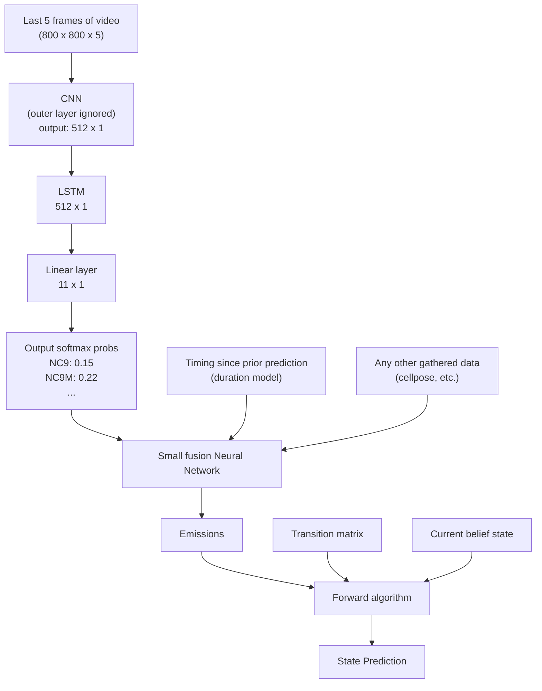

```mermaid
flowchart TD
    A["Last 5 frames of video<br/>(800 x 800 x 5)"] --> B["CNN<br/>(outer layer ignored)<br/>output: 512 x 1"]
    B --> C["LSTM<br/>512 x 1"]
    C --> D["Linear layer<br/>11 x 1"]
    D --> E["Output softmax probs<br/>NC9: 0.15<br/>NC9M: 0.22<br/>..."]

    E --> F["Small fusion Neural Network"]
    G["Timing since prior prediction<br/>(duration model)"] --> F
    H["Any other gathered data<br/>(cellpose, etc.)"] --> F

    F --> I["Emissions"]
    I --> J["Forward algorithm"]
    K["Transition matrix"] --> J
    L["Current belief state"] --> J

    J --> M["State Prediction"]
```